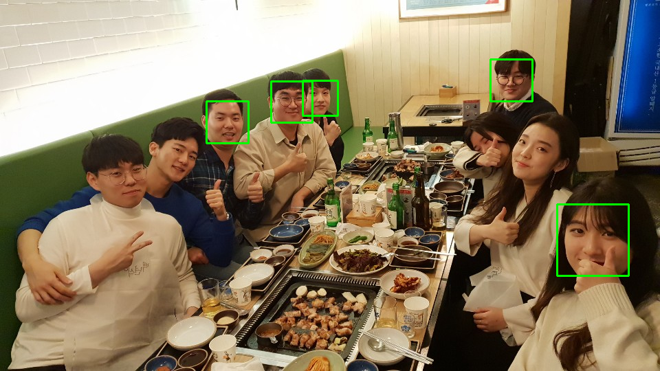
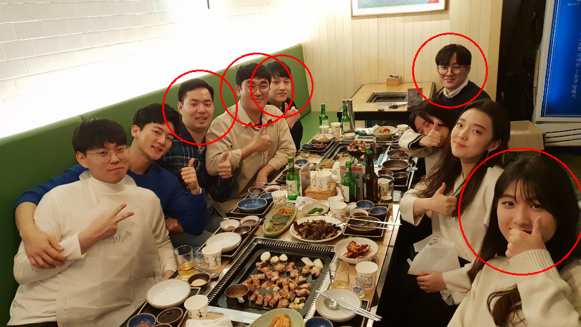

# 네 얼굴은 얼굴이니?
> 파이썬으로 OpenCV 해보자

## OpenCV란?
> OpenCV(Open Source Computer Vision)은   
주로 실시간 컴퓨터 비전을 목적으로 한 프로그래밍 라이브러리이다.  
>  원래는 인텔이 개발하였다.   
실시간 이미지 프로세싱에 중점을 둔 라이브러리이다.  
인텔 CPU에서 사용되는 경우 속도의 향상을 볼 수 있는   
IPP(Intel Performance Primitives)를 지원한다.   
> 이 라이브러리는 윈도, 리눅스 등에서 사용 가능한   
크로스 플랫폼이며 오픈소스 BSD 허가서 하에서 무료로 사용할 수 있다.  
> OpenCV는 TensorFlow , Torch / PyTorch 및  
Caffe의 딥러닝 프레임워크를 지원한다.

위의 내용은 [백과사전](https://ko.wikipedia.org/wiki/OpenCV)을 참조하였는데 재미 없죠?  

**현존하는 대부분의 컴퓨터와 모바일에서 아용 가능한** 영상인식 라이브러리
> 2006년에 나왔나? 벌써 13년째네.  
> 스노우, 콰이 등 괜찮은 카메라 앱은 전부 사용합니다

## 내가 만드는 컴퓨터의 눈!

### 응용 기술의 예

* [인간과 컴퓨터 상호 작용(HCI)](https://ko.wikipedia.org/wiki/%EC%9D%B8%EA%B0%84-%EC%BB%B4%ED%93%A8%ED%84%B0_%EC%83%81%ED%98%B8%EC%9E%91%EC%9A%A9)
* 물체 인식
* [안면 인식](https://ko.wikipedia.org/wiki/%EC%95%88%EB%A9%B4_%EC%9D%B8%EC%8B%9D_%EC%8B%9C%EC%8A%A4%ED%85%9C)
* 모바일 로보틱스
* 제스처 인식

### 카메라로 장난 치는건 전부 이거 쓰니 알아둡시다
> 제어 쪽 졸프에서 그렇게 많이 사용한다고..

### 내 컴퓨터에 OpenCV 설치하자
* [Window에 OpenCV 설치](https://docs.opencv.org/3.4.3/d5/de5/tutorial_py_setup_in_windows.html)
* [Linux나 Mac에 OpenCV 설치](https://docs.opencv.org/4.0.0-beta/d2/de6/tutorial_py_setup_in_ubuntu.html)

아래의 코드 실행 시 오류가 없이 ```import cv2```가 정상적으로 실행된다면  
**설치완료**
```bash
$ python
>>> import cv2
```

### 짧은 파이썬 코드
```python
import cv2
import sys

# 사진과 얼굴의 어떤 부분을 인식할까요?
imagePath = sys.argv[1]
cascPath = "haarcascade_frontalface_default.xml"

# haar cascade를 결정합니다
faceCascade = cv2.CascadeClassifier(cascPath)

# 이미지를 읽어와 흑백사진으로 전환합니다
image = cv2.imread(imagePath)
gray = cv2.cvtColor(image, cv2.COLOR_BGR2GRAY)

# 흑백사진 상태에서 얼굴을 탐지합니다
faces = faceCascade.detectMultiScale(
    gray,
    scaleFactor=1.1,
    minNeighbors=10,
    minSize=(30, 30)
    # flags = cv2.cv.CV_HAAR_SCALE_IMAGE
)

# 몇개의 얼굴을 찾았는지 말합니다
# 얼굴이 없는 사람들이 종종 있어요
print("Found {0} faces!".format(len(faces)))

# 얼굴에 초록색 사각형 그려주기 -> RGB (0, 255, 0)
# 빨강은 (255,0,0), 파랑은 (0,0,255)
for (x, y, w, h) in faces:
    cv2.rectangle(image, (x, y), (x+w, y+h), (0, 255, 0), 2)
    # 원으로 그린다면?
    # cv2.circle(image,(x+int(w/2),y+int(h/2)), w, (0,0,255), 2)

# 얼굴에 사각형을 친 사진을 출력합니다
cv2.imwrite("Faces.png", image)
# cv2.imwrite("Faces_circle.png", image)
cv2.waitKey(0)
```
`detectMultiScale` 함수 요소들의  [자세한 내용이 궁금하다면](https://docs.opencv.org/2.4/modules/objdetect/doc/cascade_classification.html#cascadeclassifier-detectmultiscale)

Cmd에서 아래의 명령어를 입력하면 
```bash
$ python helloOpenCV.py 얼굴사진.png 
```
### 얼굴 인식 예시
#### 원본


#### 초록색 사각형

#### 빨간색 원


## 김송이 얼굴 아니넼ㅋㅋㅋㅋㅋㅋ

참고
* [구글링에서 1번째 블로그](https://realpython.com/face-recognition-with-python/)
* [구글링에서 2번째 블로그](https://towardsdatascience.com/face-recognition-for-beginners-a7a9bd5eb5c2)
* [OpenCV 다운로드하자](https://nicewoong.github.io/development/2018/01/04/setting-opencv-dev/)